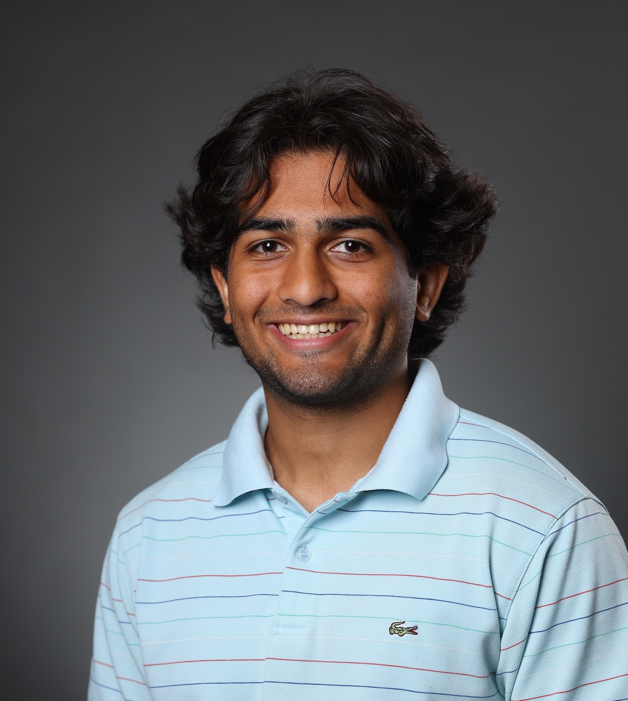

    

Welcome to my personal website! I'm a current Master of Information and Data Science student at University of California, Berkeley. I earned my Bachelor's of Science in Data Science from the University of Rochester in December, 2024. I've worked at ShotQuality, Optum, and the Los Angeles Dodgers in various tech roles. 

My interests lie in numerous fields - primarily sports analytics, tech, healthcare, and finance . I've published quite a bit of public sports analytics work, which you can find on this site and also at my [Medium](https://medium.com/@ajaypatell8). Feel free to reach out to me at 973-617-7032 or my socials linked in the bottom right of this page.
